# «Аврора»: план восстановления продукта и роста

Дата: 5 августа 2026 года
Статус: предложение до начала реализации
Основания: систематический QA/technical audit, повторная runtime-проверка и конкурентный анализ из приложенного DOCX.

## 1. Управленческий вывод

«Авроре» не следует пытаться победить SMMplanner, Onlypult или Postiz количеством социальных сетей, а Predis.ai — количеством визуальных шаблонов. Выигрышная категория уже видна:

> **«Аврора» — безопасный контент-автопилот для Telegram и VK: находит доказанный сигнал, объясняет его, создаёт оригинальный материал в стиле канала, публикует с контролем и учится на результате.**

Но это обещание пока не подтверждено продуктом end-to-end. Два P0 позволяют опубликовать сырой источник или поддельный AI-result, тема иногда подменяется, blocked result может попасть в Composer, а Autopilot способен смешать состояние каналов. Добавление новых широких функций поверх этого ядра увеличит число путей утечки и потери контекста.

Рекомендуемая последовательность:

1. **Сначала — доверие и предсказуемость:** закрыть P0/P1, сделать единый безопасный create-flow и восстановление операций.
2. **Затем — быстрый переход от конкурентов:** импорт канала, стиля, материалов и календаря; первый полезный результат менее чем за 10 минут.
3. **После — видимое отличие:** карточка доказательств, проверка оригинальности, один сигнал → пакет форматов.
4. **Потом — замкнутый автопилот:** результат через 24/48/168 часов обновляет редакционную модель канала.
5. **Только после доказательства retention — команды, inbox, десятки сетей и enterprise-функции.**

## 2. Что показали конкурентные документы

Оба приложенных файла идентичны по SHA-256 и содержат одну версию 22-страничного отчёта.

### Ближайшие угрозы

- **SmmBox:** короткая цепочка «нашёл успешный пост → переработал → опубликовал». Главная угроза по скорости и цене.
- **SMMplanner:** короткий onboarding и готовый запас публикаций на месяц.
- **LiveDune:** зрелые собственная аналитика, сравнение конкурентов и уведомления об аномалиях.
- **Postiz:** широкая публикационная основа и понятный API для внешнего AI.
- **Predis.ai / Ocoya:** превращение одной идеи в визуальную кампанию и готовые сценарии автоматизации.
- **Hootsuite / Metricool:** единый разговорный вход к данным, выводам и следующему действию.
- **SocialBee:** быстрый импорт сайта и превращение его в стратегию, рубрики и календарь.

### Правильные выводы документа

- Базовое «написать текст с AI» уже не является отличием.
- Главный moat — связка `сигнал → объяснение → оригинальный материал → безопасная доставка → обучение на результате`.
- Пользователь должен видеть доказательства, а не внутреннюю сложность системы.
- Гонка за количеством сетей экономически слабее партнёрства с готовым publication layer.
- Визуальные форматы, разговорная аналитика и быстрый импорт важны, но идут после доказательства основного цикла.

### Где документ переоценивает текущую готовность

В отчёте сильной стороной названы fact validation, запрет опасной публикации, серверные черновики, Autopilot version safety и честная readiness. Аудит уточняет:

- client может подделать `origin=ai`, provenance и `aiValidation=passed`;
- raw trend/idea/reference draft публикуем без адаптации;
- interactive blocked/off-topic result может завершиться как `done`;
- Autopilot UI переносит edit state между каналами;
- publication operation не получает terminal status;
- mail degradation скрыт глобальным UI, восстановление аккаунта не настроено.

Следовательно, конкурентная идея верна, но сначала её нужно довести до реально работающего продукта.

## 3. Продуктовый принцип: «один безопасный конвейер»

Все способы создания публикации должны использовать один серверный контракт:

```mermaid
flowchart LR
  A["Trend / Idea / Reference / RSS / Manual / Autopilot"] --> B["Immutable Source Context"]
  B --> C["Generation Operation: user + channel + source version + settings"]
  C --> D["Provider payload + request fingerprint"]
  D --> E["Server-bound Generation Result"]
  E --> F["Topic + factual + originality validation"]
  F -->|passed| G["Publishable Draft"]
  F -->|review required| H["Human review with evidence"]
  H --> G
  G --> I["Publication Operation"]
  I --> J["Verified external result"]
  J --> K["24/48/168h performance snapshots"]
  K --> L["Channel editorial model"]
```

Ключевое правило: **source context, generation result и publishable draft — разные сущности.** Клиент не назначает им trust status.

## 4. Gate 0: что исправить до новых функций

### 4.1 Разделить источник и публикацию

**Проблемы:** AUR-P0-001, stale provenance, RSS без трассируемого create-flow.

**Изменение:**

- создать серверную сущность `content_source`/`source_snapshot` с `publishable=false`;
- source хранит semantic intent, mechanics, provenance и raw untrusted content раздельно;
- Calendar и Composer никогда не показывают source как обычный draft;
- единая команда «Создать материал» создаёт generation operation, а не публикуемый raw draft.

**Польза:** пользователь не может случайно отправить чужой текст; переход из любого раздела ведёт в одинаковый понятный процесс.

### 4.2 Связать AI-result с серверной операцией

**Проблемы:** AUR-P0-002, terminal integrity, поддельные validation metadata.

**Изменение:**

- `origin`, provenance, validation, fingerprint и ACK формирует только сервер;
- terminal result связывается с `result_hash`, request id, user id, channel id, source id/version и settings hash;
- Composer получает server result id, а не доверяет клиентскому тексту;
- любое изменение текста после AI-result переводит draft в `human_edited` и требует новой/ручной attest state.

**Польза:** публикация действительно проверена; можно безопасно показывать пользователю знак доверия.

### 4.3 Исправить тему и terminal policy

**Проблемы:** AUR-P1-001…003.

**Изменение:**

- тема обязательна как структурированное поле при создании source context;
- fallback extraction возвращает несколько кандидатов и просит выбрать, а не назначает случайное предложение;
- semantic alignment работает по смыслу, один repair-pass максимум;
- после повторного `topic_alignment_failed` или factual block нет `done`, auto-open и publishable draft;
- reviewable текст сохраняется отдельно как rejected/review artifact.

**Польза:** материал остаётся по выбранной теме; пользователь не тратит лимит и время на посторонний результат.

### 4.4 Изолировать канал и Autopilot

**Проблемы:** AUR-P1-004, stale async loads.

**Изменение:**

- весь UI-state ключуется по `{userId, channelId, planId, revision, itemId}`;
- channel switch отменяет in-flight requests и закрывает/сохраняет edit session;
- на экране всегда виден канал назначения;
- Save использует identity, с которой открыт editor, а не текущий selector;
- cross-channel mismatch блокируется сервером.

**Польза:** пользователь уверенно ведёт несколько брендов без риска отправить текст не туда.

### 4.5 Закрыть recovery и operational truth

**Проблемы:** account recovery, вечный `queued`, stale AI reservations, misleading validation copy, пустые AI-логи.

**Изменение:**

- настроить mail delivery и smoke-test восстановления;
- terminal reconciliation для publication operations;
- глобальный cleanup expired reservations;
- Reliability Center и capability-specific сообщения вместо скрытой degradation;
- структурированные JSON-логи с request/operation ids.

**Польза:** пользователь понимает, что произошло, может восстановиться после ошибки и не нажимает повторно вслепую.

### Release criteria для Gate 0

- 0 открытых P0/P1 по publish/context/channel isolation;
- 100% source records непубликуемы;
- 100% AI-origin drafts имеют server result binding;
- 0 cross-channel state в E2E matrix;
- terminal topic/factual failure никогда не открывает Composer автоматически;
- все publication operations получают terminal/recoverable status;
- password recovery проходит fake-provider integration и deployment smoke-test.

## 5. Новые функции, которые одновременно исправляют продукт и добавляют пользу

| Приоритет | Функция | Что исправляет | Польза пользователю | Главная метрика |
|---|---|---|---|---|
| Now | **Единая кнопка «Создать материал»** | разные и неполные create-flow | один знакомый путь из Trends, Ideas, References, RSS и Library | completion rate карточка → draft |
| Now | **Контекстный бриф перед генерацией** | потерю темы/readerProblem/mechanics | пользователь видит тему, цель, канал и источник до списания лимита | доля запусков без возврата к настройкам |
| Now | **Карточка доказательств** | невидимый fact ledger/provenance | видно, почему выбран сигнал и какие факты разрешены | открытия карточки; отмены после проверки |
| Now | **Reliability Center** | скрытые degraded состояния и recovery | понятные статусы AI, публикации, почты и повторов | успешное восстановление без поддержки |
| Now | **«Перейти в Аврору»** | высокий switching cost | импорт канала, материалов, календаря и стиля за несколько минут | first value time; migration completion |
| Next | **Проверка оригинальности с объяснением** | риск копирования reference | показывает совпадения по фразам, структуре и смыслу, объясняет переосмысление | доля материалов без близких совпадений |
| Next | **Autopilot Control Center** | непрозрачное/опасное планирование | dry-run недели, причины выбора, массовое approve, pause/rollback | одобренные планы; отмены до публикации |
| Next | **Один сигнал → Content Pack** | разрыв между текстом и визуалом | Telegram, VK, обложка, карусель и video script из одной идеи | использование 2+ форматов на сигнал |
| Next | **Карта незанятых тем + TTL сигнала** | повторение конкурентов и устаревшие темы | показывает свободный угол и срок актуальности | доля выбранных gap ideas; expired avoided |
| Next | **Цикл результата 24/48/168** | отсутствие обучения Autopilot | объясняет, что сработало, и обновляет модель канала | lift vs channel baseline |
| Next | **Разговорная аналитика с источниками** | переходы между экранами | «Почему пост сработал?» → evidence → next action | questions leading to action |
| Later | **Командное согласование** | нет бизнес-процесса для агентств | роли, комментарии, guest link, журнал решений | team retention / paid seats |
| Later | **Partner publication API** | ограниченное число сетей | дополнительные площадки через Postiz/партнёра | connected destinations without own adapters |

## 6. Функция №1 для роста: «Перейти в Аврору»

Чтобы пользователи действительно уходили от конкурентов, недостаточно быть функциональнее. Нужно сделать переход дешевле продолжения старой работы.

### Сценарий

1. Подключить Telegram/VK.
2. Выбрать текущий сервис: SMMplanner, SmmBox, Postmypost, Onlypult или «другое».
3. Импортировать CSV/JSON/API export либо загрузить календарь и библиотеку файлов.
4. Указать сайт и закреплённую публикацию.
5. Аврора показывает, что распознано: аудитория, тон, рубрики, запреты, лучшие материалы, очередь.
6. Пользователь подтверждает каждую группу фактов; ничего внешнего не становится trusted автоматически.
7. Система создаёт первый недельный план и один evidence-backed draft.

### Обязательные элементы

- progress checklist и возможность продолжить после refresh;
- dry-run до записи/публикации;
- отчёт об импорте: принято, пропущено, требует подтверждения;
- дедупликация материалов и idempotent retry;
- импорт не меняет активный канал без явного подтверждения;
- бесплатная concierge migration для первых 20–30 каналов.

### Почему это сильнее скидки

SMMplanner выигрывает быстрым стартом, SmmBox — коротким путём к копированию. Аврора должна дать такой же быстрый старт, но завершить его оригинальным проверенным материалом. Пользователь получает ценность до того, как ему придётся заново строить весь процесс.

## 7. Как должна выглядеть удобная автоматизация

### Первый сеанс — менее 10 минут

- подключить один канал;
- импортировать сайт/лучшие публикации;
- получить автоматически заполненный профиль с явным подтверждением;
- выбрать доказанный сигнал;
- получить один оригинальный draft с карточкой доказательств;
- увидеть preview, но не публиковать без подтверждения.

### Еженедельный сеанс — 10–15 минут

- Autopilot показывает 5–7 карточек: тема, причина, доказательства, формат, канал, риск;
- пользователь меняет/замораживает отдельные карточки;
- массово подтверждает план конкретной версии;
- система публикует и честно показывает terminal state;
- через неделю показывает, какие гипотезы подтвердились.

### Ежедневный сеанс — 2–5 минут

- новые сигналы с TTL и confidence;
- один клик создаёт безопасный черновик;
- быстрые действия: «другой угол», «короче», «вариант VK», «сделать обложку»;
- каждое действие сохраняет тему, источник, канал и validation lineage.

## 8. Видимая карточка доказательств

Карточка рядом с каждым draft должна отвечать на семь вопросов:

1. Откуда взялась тема?
2. Насколько свежий сигнал?
3. Почему он необычен относительно обычного уровня канала?
4. Какие факты подтверждены и кем?
5. Что использовано только как механика/структура?
6. Чем итоговый текст отличается от источника?
7. Какие утверждения требуют подтверждения человека?

Статусы должны быть простыми:

- **Зелёный:** можно планировать;
- **Жёлтый:** нужен review конкретных утверждений;
- **Красный:** нельзя публиковать, указана причина;
- **Серый:** проверка недоступна, публикация только после ручного подтверждения.

Это не декоративная функция: она превращает сложную backend-безопасность в причину доверять продукту и платить за него.

## 9. Autopilot Control Center

Новый Autopilot должен быть не «сгенерировать неделю», а управляемым процессом:

- фиксированный channel badge и plan revision;
- режим dry-run без provider/publication side effects;
- для каждой карточки: goal, reader problem, signal/evidence, format, expected metric;
- массовое одобрение только прошедших policy gates;
- pause all / kill switch;
- лимит публикаций и AI-бюджет;
- конфликт календаря и повтор темы;
- восстановление после сбоя с terminal operation state;
- «Почему выбрано» и «Что изменилось после прошлой недели»;
- rollback только на будущие задачи, без опасной попытки скрыть уже опубликованное.

## 10. Что не нужно строить сейчас

- собственные интеграции с десятками сетей;
- единый inbox и автоматические ответы;
- нативное мобильное приложение;
- сложные agency roles и white-label reports;
- marketplace бесконечных automation recipes;
- большой видеоредактор;
- ещё один общий AI-chat без source/evidence/action model.

Эти функции полезны зрелым командам, но не исправят потерю темы, поддельную validation или опасную публикацию. Они увеличат стоимость поддержки до подтверждения основного retention.

## 11. Предлагаемая последовательность релизов

Оценка предполагает небольшую выделенную команду: product/UX, 2 full-stack/backend, frontend и QA. Сроки уточняются после технического design review.

### Релиз A — Trust Foundation

- закрыть P0/P1;
- новая модель source/result/publishable draft;
- единый create-flow;
- account recovery и reliability/recovery;
- adversarial E2E matrix.

**Результат:** платформой безопасно пользоваться вручную.

### Релиз B — Fast Switch

- мастер «Перейти в Аврору»;
- импорт сайта, закреплённого поста, лучших материалов и очереди;
- подтверждаемый профиль канала;
- evidence-backed first draft.

**Результат:** пользователь получает первую ценность быстрее, чем переносит процесс вручную.

### Релиз C — Differentiation

- evidence card;
- originality explanation;
- signal TTL и topic gaps;
- Content Pack для Telegram/VK/визуальных форматов.

**Результат:** отличие от SmmBox видно в интерфейсе, а не только в архитектуре.

### Релиз D — Learning Autopilot

- performance snapshots 24/48/168;
- editorial model updates;
- conversational analytics;
- Autopilot feedback and confidence.

**Результат:** качество и скорость улучшаются с использованием; появляется настоящий switching moat.

### Релиз E — Expansion

- approvals/roles/client links;
- partner publication API;
- reports and agency workspaces.

**Результат:** рост ARPU и выход в небольшие команды/агентства после доказанного core retention.

## 12. Метрики продукта

### Северная звезда

**Количество подтверждённо опубликованных оригинальных материалов, принятых с минимальными смысловыми правками и превысивших baseline сравнимых публикаций канала.**

### Воронка

- подключение канала → успешный импорт;
- импорт → первый evidence-backed draft;
- draft → одобрение;
- одобрение → verified publication;
- publication → результат 24/48/168;
- первая неделя → повторное использование на 4-й и 8-й неделе.

### Защитные метрики

- неподтверждённые утверждения на 100 drafts;
- source-copy blocks и близкие совпадения;
- cross-channel incidents;
- provider calls на один terminal result;
- доля fallback;
- 95-й процент времени генерации и публикации;
- recovery success без обращения в поддержку;
- себестоимость принятого и опубликованного материала.

### Начальные целевые ориентиры для пилота

- first evidence-backed draft: медиана до 10 минут после подключения;
- 0 публикаций source-only records;
- 0 forged AI-result acceptance;
- 0 cross-channel context incidents;
- не менее 95% операций получают понятный terminal/recoverable status;
- не менее 60% pilot drafts принимаются без смысловой переписки после калибровки канала;
- не менее 50% активированных каналов возвращаются к Trends/Autopilot на 4-й неделе.

Последние два показателя — продуктовые гипотезы, а не обещания; их нужно проверить на когорте 20–30 каналов.

## 13. Технические зоны изменений

### Обязательно затронуть

- `src/lib/server-drafts.ts`, `src/lib/draft-review.ts`, draft API и DB migrations;
- `src/app/api/ai/generate/route.ts`, ACK/result recovery, AI usage и provider logging;
- `src/lib/reference-adaptation.ts`, topic alignment, fact ledger и originality policy;
- Studio, Composer, Calendar и все handlers «Создать публикацию»;
- Autopilot page/API/scheduling и channel-scoped state;
- publication operations/outbox/worker terminal reconciliation;
- readiness, shell health UX, password/email delivery;
- analytics/stat collection и verified publication lifecycle.

### Новые bounded-модули

- source context contract и immutable snapshot;
- server generation artifact/result binding;
- evidence card projection;
- originality comparison service;
- import/migration jobs;
- publication hypothesis + performance snapshots;
- channel editorial model revisions.

## 14. Обязательная тестовая программа

- E2E для каждого входа: Trend, Idea, Reference, RSS, Manual, Autopilot;
- новая вкладка, refresh, Back/Forward, double click, retry, stale version;
- несколько каналов и пользователей;
- provider timeout/fallback/replay/ACK;
- topic passed/partial/failed и один repair-pass;
- prompt injection и factual markers;
- изменение текста после validation;
- source-only publish attempts;
- import idempotency и partial recovery;
- publication terminal reconciliation;
- 24/48/168 snapshot idempotency;
- mobile layouts и accessible error recovery.

## 15. Решение перед реализацией

Рекомендую утвердить следующий продуктовый порядок:

1. **Gate 0 — Trust Foundation.**
2. **Fast Switch + первый draft менее чем за 10 минут.**
3. **Evidence Card + Originality.**
4. **Content Pack + Signal TTL/Topic Gaps.**
5. **Learning Autopilot.**
6. **Teams/API/extra networks — только после подтверждения retention.**

Такой порядок одновременно исправляет критические дефекты, делает платформу проще и создаёт причину уйти от конкурента: не «ещё один AI-постинг», а управляемая система, которая объясняет, безопасно автоматизирует и доказывает результат.
