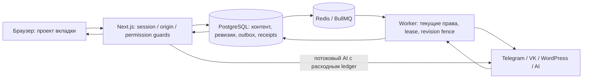

# Карта runtime и проверок

Это карта текущего кода и локальных команд. Она не подтверждает состояние production
и не разрешает деплой, изменение рабочих БД, платные вызовы или реальные публикации.

## Путь операции

PostgreSQL хранит авторитетные состояния операций, согласованные ревизии, квитанции
частей и назначений, расходные попытки AI и квоты медиа. Redis доставляет задания,
хранит ограничители и heartbeat; его очередь сама по себе не доказывает успешную
публикацию. После неизвестного результата отправки нельзя менять состояние на
«не отправлено» или слепо повторять запрос. UI читает сохранённое состояние сервера.

Проект чтения/записи приходит из `projectFetch` или явного native URL selector;
права повторно проверяются сервером и в чувствительных worker-путях. AI может
работать как потоковый HTTP-запрос либо в фоновой очереди; денежные ограничения
охватывают платные неуспешные попытки. Медиа хранится через имеющиеся PostgreSQL/S3
адаптеры с суммарными квотами и журналом удаления объектов.

## Процессы и зависимости

| Процесс/путь | Точка входа | Зависимости и граница |
| --- | --- | --- |
| Web | Next App Router; `src/instrumentation.ts` | PostgreSQL, session/permission guards; Redis для очередей/лимитов; provider access для разрешённых синхронных операций. Sentry и admin scheduler подключаются отдельно от worker. |
| Полный worker | `worker.mjs` | PostgreSQL/schema preflight, Redis/BullMQ, контролируемые provider credentials; потребители publication, Autopilot, media/render, stats/cron, Sites, exports и другие зарегистрированные задачи. |
| Специализированные режимы | `AURORA_WORKER_MODE` в `worker.mjs` | `publication`, `media`, `autopilot` выбирают подмножества потребителей. Наличие одного такого процесса не означает, что весь продукт обслуживается. |
| Отдельный site-analysis worker | `scripts/site-analysis-worker.mjs` | Собственный preflight и потребитель site-analysis; не заменяет полный worker и site-articles consumer. |
| Admin observation/alerts | `src/lib/admin-system-diagnostics.ts`, `admin-alerts-scheduler.ts`, `scripts/report-runtime-operations.mjs` | Привилегированное наблюдение, независимые probes и отдельный read-only snapshot. Наличие конфигурации не доказывает доставку алерта. |
| Hosted Sites | `/hosted/...`, `src/lib/site-hosted/*` | Публичная проекция подтверждённой ревизии своего назначения; WordPress имеет отдельный receipt/state. |

`AURORA_RUNTIME_ROLE` различает web/worker/shared бюджет пула БД. Сам `worker.mjs`
задаёт роль worker, чтобы не унаследовать роль web из общего файла окружения.
Schema readiness проверяет текущий manifest и требуемые возможности до запуска
потребителей. `/api/health` — живость процесса; `/api/readiness` различает готовность
web, публикаций, Telegram polling, AI, mail, uploads, token encryption и tracking.
`configured`, `unobserved` и доступная HTML-страница не равны production readiness.

## Команды запуска

| Команда | Фактическое поведение |
| --- | --- |
| `npm run dev` | `scripts/dev.mjs` загружает локальное окружение, выполняет bootstrap и запускает Next dev плюс полный worker; смерть одного завершает второй. Это обычный локальный runtime проекта. |
| `npm run dev:web` | Тот же полный `scripts/dev.mjs`; название не означает web-only. |
| `npm run dev:web-only` | Только Next dev; допускается для явно изолированной UI-работы, не доказывает готовность фоновых функций. |
| `npm run build` | `scripts/build.mjs`: build lock, контролируемый heap, Next production build с webpack. `NEXT_PUBLIC_*` относится к браузерной сборке. |
| `npm start` | `scripts/start.mjs`: production preflight, затем Next start и worker; связанное завершение процессов. |
| `npm run start:web`, `npm run start:worker` | Раздельные процессы; оператор обязан обеспечить весь требуемый набор потребителей и предварительную проверку схемы. |
| `npm run worker:*` | Выделенные worker-команды из package.json; читают локальный env-файл. Не запускать их из рабочей копии при изолированном QA. |

Для Autopilot дополнительно проверяется активный потребитель `autopilot-plans`;
`stats` не заменяет его. Redis, web и нужные worker-режимы должны относиться к одной
контролируемой среде. Отдельные production systemd/container units описаны в
`scripts/deploy-production.sh`; фактическое их наличие требует внешней проверки.

## Изоляция тестов

Рабочие `.env*` не используются в audit runtime. Тестовые приложения собираются и
запускаются из изолированной копии без рабочих env-файлов, с явно заданными
подключениями, fake providers и одноразовыми БД/Redis namespaces. `worker`,
`db:migrate`, sandbox smoke и часть maintenance-команд в package.json сами
подгружают `.env.local`; это не универсальные безопасные тестовые entrypoints.

Integration suites используют `vitest.integration.config.ts` или отдельные
`scripts/test-*-integration.mjs`, проверяют допустимый локальный target и имеют
собственный lifecycle фикстур. Не запускать suites, которые очищают одну и ту же
БД, параллельно. OAuth suite имеет собственную `aurora_oauth_context_test` и
fresh-schema/migration bootstrap; она не зависит от запуска project-context suite.

`npm test` не включает `*.integration.ts`: его `vitest.config.ts` охватывает
unit/contract/React DOM файлы. Для integration необходимы отдельные команды CI.
Real E2E использует `E2E_DATABASE_URL`, `E2E_REDIS_URL`, production build и полный
runtime с fake provider boundaries. Отсутствующий браузер/backup/provider fixture
фиксируется как ограничение или неуспех, а не PASS.

## CI и реестр suite

`.github/workflows/ci.yml` устанавливает зависимости, проверяет production dependency
audit, lint/typecheck, запрет focused/skipped tests, additive migrations, все
зарегистрированные integration suites, два production build, worker syntax,
unit/contracts, hydration и реальные journeys в Chromium/Firefox/WebKit.
`.github/workflows/e2e-stability.yml` — отдельный ручной gate 30 полных циклов трёх
движков с manifest, traces, video и проверкой неизменности входной версии.
Само присутствие workflow не доказывает его успешный запуск на release candidate.

Состав integration entry-файлов, package commands, CI-вызовы и незарегистрированные
остатки перечислены в реестре проверки ниже. `scripts/test-rollback-target-integration.mjs` — явное исключение: он
требует указанную архивную копию точного rollback target, одноразовую восстановленную
БД и outbound hold; автоматического запуска против произвольного checkout нет.
Реестр с каждой строкой находится в
`audit-2026-09-05/evidence/implementation/Q01-integration-registry.json`.

Проверка точного старого rollback-кода может показать совместимость SQL и одновременно
небезопасность его работающих web/worker. Следовать процедуре quarantine и внешнего
согласования; нельзя возобновлять отправки на основании зелёного schema probe.

## Связанные инструкции

- [Permissions и полный scope](permissions-and-scope.md)
- [Статический реестр env](env-inventory.md)
- [Telegram ownership](telegram-channel-ownership.md)
- [Telegram background receipts и восстановление](telegram-background-notifications.md)
- [AI spend control](ai-spend-control.md)
- [Media lifecycle](media-storage-lifecycle.md)
- [Delivery, storage, restore и rollback](delivery-and-storage-release.md)
- [Observation и external release evidence](observability-release.md)
- [DB pool runbook](../stabilization/database-pool-runbook.md)
- [Admin operations center](../admin-operations-center-runbook.md)

RPO/RTO, бюджеты, retention, получатели алертов, доступ к реальному backup и
production topology остаются входами владельца/оператора. Эта карта их не назначает.
